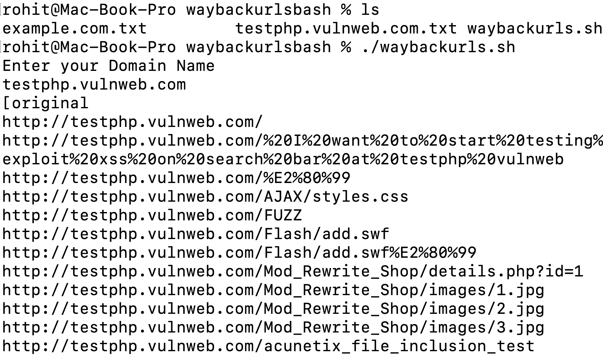

# waybackurlsbash
crawling urls for targets from wayback implementation in bash  

Steps:  
-> chmod +x waybackurls.sh  
-> ./waybackurls.sh and Enter your target name  
-> A file will be created with enumerated urls with same name.  
-> Happy hunting  

